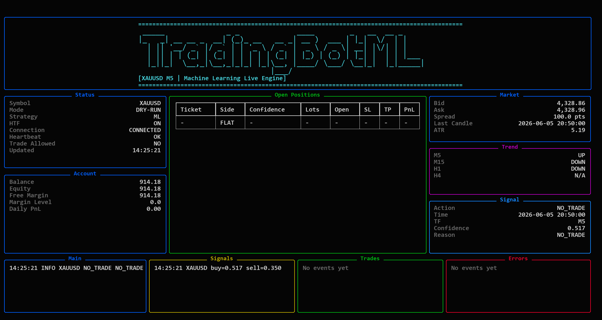

# Multi-Symbol M5 ML Trading Bot

Framework riset dan eksekusi trading berbasis Python untuk sinyal machine learning MetaTrader 5 pada data market timeframe M5.

Project ini saat ini menargetkan:

- `XAUUSD`
- `USTEC`
- `USTEC_X100`

Fitur utama mencakup download data historis MT5, feature engineering, labeling ATR barrier, model ML per sisi BUY/SELL, walk-forward validation, pencarian threshold, weekly retraining, live signal dry-run, dan eksekusi order MT5 dengan guard produksi.

## Kebijakan Produksi Saat Ini

Repository ini dikonfigurasi dengan prinsip **fail closed**.

- Eksekusi order real nonaktif secara default untuk semua symbol.
- Live trading wajib memiliki metadata canonical `models/<SYMBOL>/live_model_meta.json`.
- Metadata live wajib lolos gate artifact, side, broker spec, dan deployment.
- Artifact yang hilang, stale, tidak lengkap, atau hash-nya tidak cocok akan memblokir trading.
- Live bot default berjalan dalam mode dry-run kecuali flag `--trade` diberikan secara eksplisit.
- Akun non-demo ditolak kecuali flag `--allow-real-account` diberikan secara eksplisit.

Jangan gunakan modal live sampai hasil forward test/demo sesuai dengan asumsi backtest selama beberapa minggu.

## Kemampuan Utama

- Download data OHLCV MT5 per symbol.
- 80+ fitur teknikal, volatility, session, range, momentum, dan volume.
- Label ATR barrier untuk `NO_TRADE`, `BUY`, dan `SELL`.
- Dukungan model binary terpisah untuk BUY dan SELL.
- Model XGBoost dengan tuning Optuna opsional.
- Probability calibration dan ensemble training di pipeline walk-forward.
- Optimasi threshold berbasis hasil backtest.
- Rolling walk-forward validation dengan purge pada boundary split.
- Weekly retraining dengan deployment gate ketat.
- Logging live signal MT5 dalam mode dry-run dan eksekusi order dengan guard.
- Persistent live state untuk cooldown dan duplicate-order protection.
- Laporan data quality dan integritas artifact.
- Terminal live dashboard berbasis Rich untuk memantau status, market, signal, posisi, dan event log.

## Live Dashboard

Dashboard terminal menampilkan status koneksi MT5, akun, market, trend multi-timeframe, sinyal ML, posisi terbuka, dan event log live dalam satu tampilan.



Jalankan dashboard live dry-run:

```powershell
python src/live_mt5.py --all --dashboard
```

Fokus ke symbol tertentu:

```powershell
python src/live_mt5.py --symbol XAUUSD --dashboard --dashboard-symbol XAUUSD
```

## Struktur Repository

```text
src/
  config.py                  Konfigurasi global dan definisi symbol
  download_mt5_data.py        Downloader data historis MT5
  features.py                 Feature engineering
  labeling.py                 ATR barrier label dan diagnostics
  train.py                    Training model baseline
  walk_forward_pipeline.py    Pipeline walk-forward institutional-style
  walk_forward_backtest.py    Simulasi trade OOS dan metrics
  walk_forward_threshold.py   Threshold search
  weekly_retrain.py           Retraining window terbaru dan deployment gate
  live_mt5.py                 Live dry-run / execution runner MT5
  live_dashboard.py           Rich terminal dashboard untuk live monitoring
  production.py               Helper validasi artifact dan production gate
tests/
  test_core.py                Unit test dan regression test
data/
models/
reports/
logs/
```

Data, model, report, log, dan trade export hasil generate diabaikan oleh Git. File `.gitkeep` dipakai untuk mempertahankan struktur folder.

## Kebutuhan Sistem

- Python 3.10+
- Terminal desktop MetaTrader 5
- Akun MT5 yang sudah login
- Symbol broker terlihat di Market Watch

Install dependency:

```powershell
python -m venv .venv
.\.venv\Scripts\Activate.ps1
pip install -r requirements.txt
```

## Konfigurasi Symbol

Edit `src/config.py` jika broker memakai nama symbol berbeda:

```python
SYMBOLS["XAUUSD"]["mt5_symbol"] = "XAUUSDm"
SYMBOLS["USTEC"]["mt5_symbol"] = "US100.cash"
SYMBOLS["USTEC_X100"]["mt5_symbol"] = "USTEC_x100"
```

Symbol yang belum dikonfigurasi akan ditolak secara sengaja. Tambahkan symbol baru secara eksplisit ke `SYMBOLS` sebelum digunakan.

## Pipeline Riset Baseline

Jalankan dari root repository:

```powershell
python src/download_mt5_data.py --all
python src/features.py --all
python src/labeling.py --all
python src/train.py --all
python src/threshold_search.py --all
python src/backtest.py --all
```

## Walk-Forward Validation

Jalankan evaluasi walk-forward per symbol:

```powershell
python src/walk_forward_pipeline.py --symbol XAUUSD --trials 50
python src/walk_forward_pipeline.py --symbol USTEC --trials 50
python src/walk_forward_pipeline.py --symbol USTEC_X100 --trials 50
```

Gunakan `--resume` untuk melanjutkan run yang belum selesai:

```powershell
python src/walk_forward_pipeline.py --symbol USTEC_X100 --trials 50 --resume
```

Pipeline walk-forward menulis report ke:

```text
reports/<SYMBOL>/walk_forward_<MODE>/
models/<SYMBOL>/walk_forward_<MODE>/
```

Hanya hasil yang lolos gate ketat yang boleh memperbarui metadata live canonical:

```text
models/<SYMBOL>/live_model_meta.json
```

## Optimization Workflow

Gunakan `src/optimize_research_workflow.py` untuk menjalankan pencarian labeling terbaik, feature set terbaik, walk-forward final, weekly retrain, dan summary ranking.

Default workflow:

```text
prepare -> label -> feature -> walk_forward -> retrain -> summary
```

### Quick Start Tanpa Download Data

Gunakan `--skip-download` jika raw data lokal sudah tersedia di `data/raw/<SYMBOL>/`.

```powershell
python src/optimize_research_workflow.py --all --per-symbol --smoke --resume --skip-download --dry-run
python src/optimize_research_workflow.py --all --per-symbol --trials 50 --resume --skip-download
```

Dengan `--skip-download`, stage `prepare` hanya menjalankan:

```text
features.py -> labeling.py
```

dan tidak memanggil `download_mt5_data.py`.

### Contoh XAUUSD

```powershell
# Lihat command tanpa menjalankan
python src/optimize_research_workflow.py --symbol XAUUSD --per-symbol --smoke --resume --skip-download --dry-run

# Full optimization memakai data lokal/cache
python src/optimize_research_workflow.py --symbol XAUUSD --per-symbol --trials 50 --resume --skip-download

# Buat summary dari report yang sudah ada
python src/optimize_research_workflow.py --symbol XAUUSD --stages summary
```

### Stage Terpisah

```powershell
# Regenerate feature dan label dari data lokal
python src/optimize_research_workflow.py --symbol XAUUSD --stages prepare --skip-download

# Cari labeling terbaik
python src/optimize_research_workflow.py --symbol XAUUSD --stages label --trials 50 --resume

# Cari feature set terbaik
python src/optimize_research_workflow.py --symbol XAUUSD --stages feature --trials 50 --resume

# Jalankan walk-forward final
python src/optimize_research_workflow.py --symbol XAUUSD --stages walk_forward --trials 50 --resume

# Weekly retrain tanpa update live_model_meta.json
python src/optimize_research_workflow.py --symbol XAUUSD --stages retrain --trials 50
```

Tambahkan `--force-download` hanya jika ingin refresh data dari MT5. Jangan pakai `--force-download` jika ingin tetap memakai data lokal/cache.

Report ranking ditulis ke:

```text
reports/optimization/optimization_summary.md
reports/optimization/optimization_summary.csv
reports/optimization/optimization_summary.json
```

Panduan lengkap ada di `docs/OPTIMIZATION_WORKFLOW.md`.

## Weekly Retraining

Jalankan retraining dengan window terbaru:

```powershell
python src/weekly_retrain.py --all --trials 50 --force-download
```

Jalankan retraining tanpa memperbarui metadata live:

```powershell
python src/weekly_retrain.py --all --trials 50 --force-download --no-deploy
```

Jika deployment gate gagal, artifact dan report tetap ditulis, tetapi `live_model_meta.json` tidak diubah.

## Live Dry-Run

Evaluasi candle closed terbaru satu kali:

```powershell
python src/live_mt5.py --all --once
```

Jalankan dry-run secara kontinu:

```powershell
python src/live_mt5.py --all
```

Signal akan ditulis ke:

```text
logs/live_signals.csv
```

Analisis log live signal:

```powershell
python src/analyze_live_signals.py
```

## Eksekusi Order Real

Order real hanya bisa dikirim jika semua syarat berikut terpenuhi:

- Flag `--trade` diberikan.
- Akun demo, kecuali `--allow-real-account` diberikan secara eksplisit.
- Config symbol `enabled_for_live=True`.
- Metadata canonical `live_model_meta.json` memiliki `gate_status="passed"`.
- Validasi hash artifact lengkap.
- Threshold eligible dan tidak memakai fallback.
- Side yang boleh trading tercatat di metadata.
- Broker menyediakan tick size, tick value, dan point.
- Guard spread, session, regime, position, risk, cooldown, duplicate-order, dan batas harian semuanya lolos.

Command:

```powershell
python src/live_mt5.py --all --trade
```

Gunakan hanya setelah validasi demo yang stabil.

## Validasi

Jalankan:

```powershell
python -m compileall src tests
python -m unittest discover tests
```

Test suite mencakup:

- Validasi symbol.
- Behavior feature dan label pipeline.
- Behavior walk-forward split dan gate.
- Behavior threshold search.
- Loading artifact canonical.
- Gate weekly retrain.
- Fail-safe live dan duplicate-order logic.

## Catatan Production Readiness

Sistem ini memiliki guard produksi, tetapi profit tidak dijamin. Sebelum live:

- Jalankan ulang walk-forward validation memakai data broker terbaru.
- Pastikan money PnL tersedia untuk setiap symbol.
- Masukkan asumsi commission dan slippage yang realistis.
- Review performa OOS per side.
- Jalankan live dry-run dan demo forward test selama beberapa minggu.
- Bandingkan fill aktual, spread, slippage, dan PnL dengan asumsi backtest.

## Disclaimer Risiko

Software ini dibuat untuk riset dan engineering. Algorithmic trading memiliki risiko besar. Backtest dan walk-forward report dapat melebihkan performa live karena kondisi broker, spread, slippage, latency, rejection, news event, perubahan regime, dan model drift. Gunakan dengan risiko sendiri.
